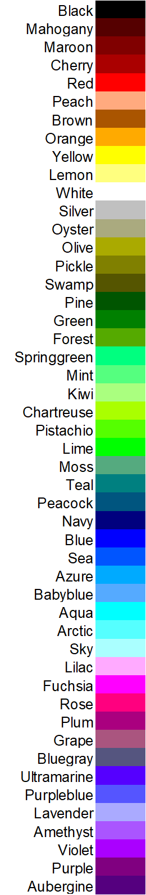

# PSI-QA

### Prerequisites & Installation Requirements

Pipeline run and tested on a Linux (Ubuntu) machine using Python 3.6.13

* Python libraries
  * Pandas
  ``` pip install pandas ``` 
  * OpenCV-Python
  ``` pip install opencv-python```
  * openslide library
  ``` pip install openslide-python ```
      * For Windows users, please download and extract the most recent stable openslide binary into your workspace directory, and change line 12 of ```WSI_to_ROIs.py``` to rename the directory name. 
  * lxml
  ``` pip install lxml ```
* scikit-image
``` pip install scikit-image ```
* numpy
* matplotlib
``` pip install matplotlib ```
#### 1. fileProcess.py
#### 2. WSI_to_ROIs_final.py
#### 3. generate_lookup_table.py
#### 4. ROI_preprocess_final.py
#### 5. ROI_grouping.py


### Color dictionary provided to users


### Obtaining NormRGBHist.m
Stain Normalisation Toolbox (V2.2) by Tissue Image Analytics (TIA) Centre at the University of Warwick
https://warwick.ac.uk/fac/cross_fac/tia/software/sntoolbox/ 
Should be unzipped and placed under the working MATLAB directory
